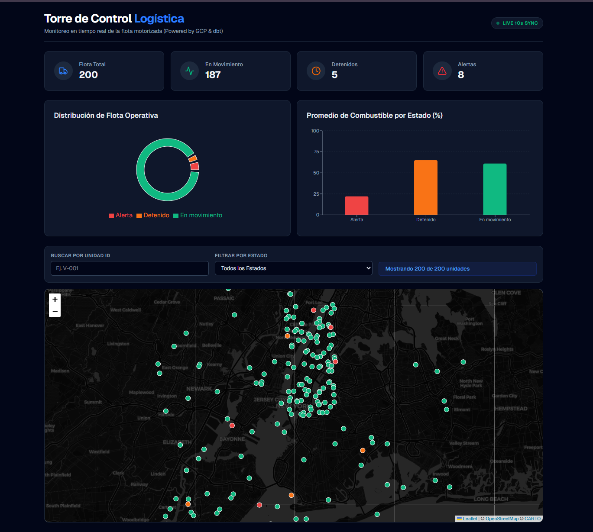
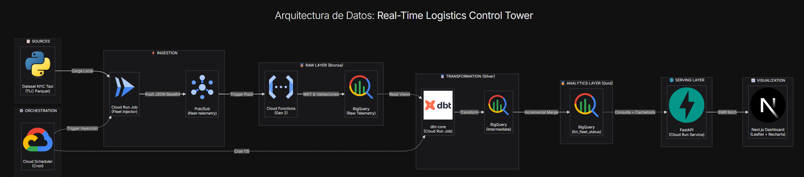

# 🚛 Real-Time Logistics Control Tower

Un sistema *End-to-End* de Ingeniería de Datos para el monitoreo en tiempo real de una flota de cientos de vehículos, resolviendo el problema de rastreo geoespacial y consumo de métricas corporativas utilizando infraestructura **Serverless en Google Cloud Platform (GCP)**.



---

## 🎯 Problema de Negocio Prescrito
Las empresas de logística tradicional sufren de **visibilidad fragmentada** sobre su flota, enfrentando altos costos operativos por camiones inactivos y demoras prolongadas para detectar un nivel crítico de combustible. Este proyecto resuelve la limitante entregando una **Torre de Control** de baja latencia capaz de absorber miles de eventos telemáticos por minuto y exponerlos visualmente en menos de 5 segundos.

---

## 🏗️ Arquitectura y Tecnologías
La arquitectura está orientada a eventos (EDA) dividida en cuatro capas lógicas puramente Serverless:

### 1. Ingesta (Simulada)
- **Python / Cloud Run Jobs**: Un inyector asíncrono que emula dispositivos IoT de la flota basándose en el ecosistema real del set de datos *NYC TLC Trip Record*. 
- **Google Cloud Pub/Sub**: Bus de mensajería desacoplado capaz de absorber los picos masivos de streaming geoespacial.

### 2. Procesamiento Crudo (Raw)
- **Cloud Functions (Gen 2)**: Gatillada vía Pub/Sub, la función parsea los mensajes base64, filtra coordenadas corruptas de GPS y genera de inmediato un Punto vectorizado (`WKT GEOGRAPHY`) enviándolo a BigQuery con resiliencia de reintentos (`Tenacity`).

### 3. Transformación Analítica Integrada (dbt)
Orquestado mediante **Cloud Scheduler** cada 5 minutos, un contenedor dedicado de Cloud Run despierta la herramienta **Data Build Tool (dbt)**:
- **Capa Staging (View)**: Estandariza tipados y casteos.
- **Capa Intermediate (Tables)**: Cruza ventanas históricas (`LAG() OVER`) para calcular métricas complejas (ej. *Distancia recorrida vs parada*).
- **Capa Mart (Incremental)**: Materializa la versión unificada de un "Estado Actual de Flota", sobrescribiendo inteligentemente los vehículos activos.

### 4. Capa de Servido (Backend + Frontend)
- **FastAPI**: Un microservicio de alta concurrencia alojado en Cloud Run. Protege la facturación de BigQuery implementando una barrera **Caché en Memoria (`cachetools`)** de corto plazo (10-30s).
- **Next.js + TailwindCSS**: Un frontend interactivo "Dark Mode", consumiendo la API asíncronamente vía *SWR*. Proyecta Puntos Vectoriales en un mapa de **React Leaflet** empalmados a gráficos estadísticos con **Recharts**.

---

## 💻 Diagrama de Arquitectura


*(Ver el archivo adjunto [architecture.html](./architecture.html) para visualizar el diagrama de manera vectorizada y responsiva en el navegador).*

---

## 🚀 Despliegue del Proyecto

Múltiples componentes se integran de forma automática gracias al IaC nativo de Google y Service Accounts. 

**Prerrequisitos:**
1. Autenticación en Google Cloud SDK: `gcloud auth application-default login`
2. Node.js v18+ y Python 3.12+ instalados.

**Ejecución Rápida:**
1. Crear infraestructura inicial en GCP y levantar variables de entorno en el root (`.env`).
2. Configurar perfil de dbt usando autenticación OAuth (`profiles.yml`).
3. Someter imágenes a Cloud Run Jobs:
```bash
# Inyector IoT
gcloud run jobs deploy fleet-injector --source injector/ --region us-central1
# Transformador analítico dbt
gcloud run jobs deploy dbt-transformer --source dbt/ --region us-central1
```
4. Lanzar Frontend (Cliente Next.js):
```bash
cd frontend
npm install
npm run dev
```

---
*Hecho por un Data Engineer, diseñado para escalar globalmente.*
